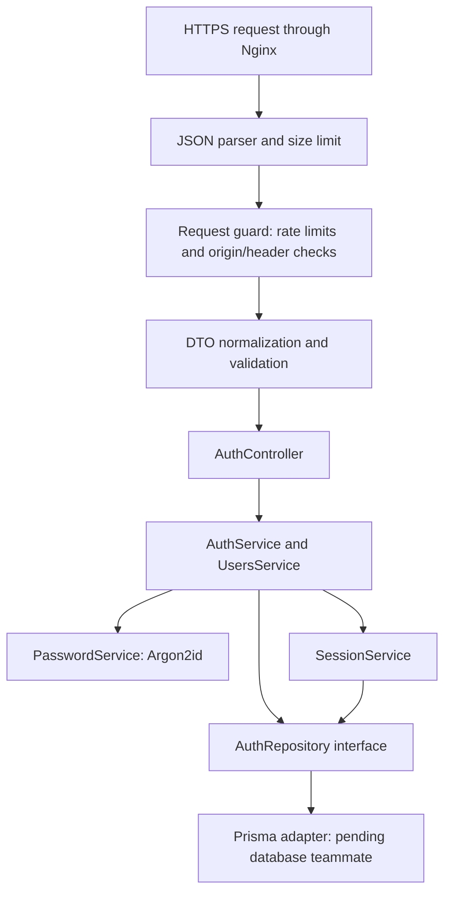

# Authentication stage 2: request flow and cookie sessions

Implemented in `chess_git/git_brogal`, 2026-10-06. The database teammate's Prisma/PostgreSQL work is not ready. This stage implements the HTTP and authentication behavior against an explicit repository interface. **The deployed application does not yet create real accounts:** its default repository returns 503 for operations requiring storage. Test storage exists only under `backend/test/`.

## What happens next, and why this split helps

Stage 1 established which inputs are acceptable and how to hash passwords. Stage 2 connects those pieces to registration and login, and adds sessions so the server can identify the same user on subsequent requests. The database boundary lets both developers work without independently creating conflicting schemas or migration histories.



`GET /me` uses SessionGuard instead of credential DTOs: it looks up the cookie token's hash, checks expiry on every request and attaches only safe account fields. Logout uses an explicitly empty DTO. Nest guards run before parameter validation; account rate-limit keys therefore use a type-checked, bounded, normalized email rather than trusting an already validated DTO.

## Route behavior

| Route | Successful behavior | Important failures |
|---|---|---|
| `POST /api/auth/register` | 201 `{user}`; hashes password and creates account; does not log in automatically | 400 invalid input; 409 duplicate email/username; 503 missing/unavailable storage |
| `POST /api/auth/login` | 200 `{user}`; verifies password; replaces this browser's old session atomically; sets secure cookie after persistence succeeds | Same 401 for unknown email/wrong password; no cookie when persistence fails |
| `GET /api/auth/me` | 200 `{user}` for an existing unexpired cookie session | 401 absent/invalid/revoked/expired session; 503 storage outage |
| `POST /api/auth/logout` | 204; deletes current session then clears cookie; repeat/no-cookie logout succeeds | 400 nonempty/invalid body; 503 if an existing token cannot be revoked |

All mutation routes require JSON, exact configured Origin and `X-CSRF-Protection: 1`. Errors follow `{error: {code, message, fields?}}`; credentials, hashes, tokens and raw database errors are not returned. A missing database does not simulate successful registration/login. `/api/health` remains process liveness only, not proof that authentication storage is ready.

The returned owner profile is exactly `{id, email, username, createdAt}`. Future public profile endpoints must omit email. No password hash is passed to the HTTP response mapper.

## Code walkthrough

1. [AuthController](../backend/src/auth/auth.controller.ts) declares the four endpoints, DTOs, guards and cookie operations. It has no SQL or password hashing logic.
2. [AuthService](../backend/src/auth/auth.service.ts) orchestrates registration/login; [UsersService](../backend/src/auth/users.service.ts) translates repository outcomes to safe profile data or HTTP errors.
3. [AuthRepository](../backend/src/auth/auth.repository.ts) is the database contract. The default [unavailable adapter](../backend/src/auth/unavailable-auth.repository.ts) rejects storage operations. It never stores data or grants authentication.
4. [SessionService](../backend/src/auth/session.service.ts) issues, checks and revokes sessions; [session-cookie.ts](../backend/src/auth/session-cookie.ts) handles random token generation, SHA-256 hashing and strict cookie extraction.
5. [SessionGuard](../backend/src/auth/session.guard.ts) is reusable by later authenticated endpoints. Import AuthModule and apply `@UseGuards(SessionGuard)`; a session check does not replace per-resource authorization.
6. [AuthRequestGuard](../backend/src/auth/auth-request.guard.ts) checks origin/header and applies [rate limits](../backend/src/auth/auth-rate-limiter.ts). [AuthExceptionFilter](../backend/src/auth/auth-exception.filter.ts) formats safe auth errors and Retry-After.

## Session policy

- Generate 32 random bytes; encode as a 43-character unpadded base64url bearer token.
- Store only its SHA-256 hex digest. Never store the raw cookie value. Passwords continue to use Argon2id, not SHA-256.
- Cookie: `__Host-session`, Secure, HttpOnly, SameSite=Lax, Path=/, no Domain, explicit Expires.
- Default absolute expiry is seven days. It is not extended by `/me` requests.
- Re-login replaces only the browser's presented old token. Other browser sessions are unaffected. Failed login does not revoke the existing valid session.
- Every request checks database presence and expiry, so logout takes effect immediately. This is not a stateless JWT flow.
- With a configured adapter, an hourly timer deletes at most 500 expired rows and never overlaps itself. A cleanup backlog does not make expired tokens valid; monitor/tune batch size if usage grows.
- Ambiguous duplicate session cookies and malformed tokens are rejected. Tokens in query parameters or Authorization headers are not used.

## Database teammate: implement this adapter

The table/constraint requirements remain in [auth-database-handoff.md](auth-database-handoff.md). The next integration deliverable is a Nest injectable class extending `AuthRepository`, with `configured = true`, using the shared PrismaService:

| Method | Required implementation |
|---|---|
| `createAccount(input)` | Insert canonical fields; return Date values and account ID; translate ONLY email/username unique violations to AccountConflictError |
| `findAccountByEmail(email)` | Exact unique lookup of canonical email; return account including encoded password hash, or null |
| `replaceSession(previousHash, session)` | In one transaction, delete matching old hash if supplied and insert the new session; any failure rolls both operations back |
| `findSession(hash)` | Unique lookup with owning user; return Date timestamps; select safe user fields without passwordHash |
| `deleteSession(hash)` | Idempotent delete; DB failures must reject, not look like success |
| `deleteExpiredSessions(now, limit)` | Delete at most limit rows with expiresAt <= now; return actual count; use expiry index |

Wire the provider in [AuthModule](../backend/src/auth/auth.module.ts): import DatabaseModule and replace `{ provide: AuthRepository, useClass: UnavailableAuthRepository }` with `{ provide: AuthRepository, useClass: PrismaAuthRepository }`. Let Nest inject the shared PrismaService into that adapter. Do not register both providers under the same token, create another connection pool, or import test storage.

The adapter must pass integration tests against real PostgreSQL before the module is considered functional. Specifically verify concurrent unique registration, transaction rollback on session replacement, revocation, session expiry, persistence across process restart and cleanup limits. The current in-memory test double validates orchestration/error mapping, **not PostgreSQL constraints or transaction isolation**.

## Configuration and proxy behavior

Compose now explicitly passes these `.env` settings to the backend:

| Variable | Default | Meaning |
|---|---|---|
| `APP_ORIGIN` | `https://localhost` | Exact browser origin; no path or trailing slash. Set to the deployed HTTPS origin, including nondefault port if used. |
| `SESSION_TTL_SECONDS` | `604800` | Integer between 60 and 604800; invalid values stop startup. |
| `TRUSTED_PROXY_IP` | empty | Optional exact Nginx IP; broad CIDRs, `true` and wildcards are rejected. |

With blank TRUSTED_PROXY_IP, Express ignores forwarded headers. Requests coming through Nginx share the Nginx IP's rate limit. For real multi-user deployment, the infrastructure owner should assign Nginx a stable internal IP and configure that exact address here. Do not publish the backend port or replace this with unrestricted proxy trust. Nginx now overwrites X-Forwarded-For with the actual client address, rather than appending a supplied header.

Current single-process limits: 60 auth requests per IP/minute; 20 combined register/login attempts per IP/15 minutes; 10 attempts per canonical email/operation/15 minutes. Counts include successful attempts. Responses include 429 and Retry-After. A maximum of 10,000 rate-limit entries bounds memory; exhaustion returns 503 rather than evicting active limits. Counters reset on process restart and are not shared across replicas. Keep the planned one-backend deployment; use shared limits before scaling horizontally. Temporary account throttling can be triggered by another person who knows the email; this tradeoff should be revisited with deployment telemetry.

The existing 16 KiB backend JSON limit now has an auth-specific Nginx limit with a JSON 413 response. Local certificate generation includes a localhost/127.0.0.1 Subject Alternative Name; it is still self-signed and needs explicit local trust. A second computer needs the actual reachable hostname in a trusted certificate—localhost does not solve remote access. No insecure cookie mode was added.

## Frontend integration after the database adapter lands

From the existing same-origin React app:

```ts
const response = await fetch('/api/auth/login', {
  method: 'POST',
  credentials: 'same-origin',
  headers: {
    'Content-Type': 'application/json',
    'X-CSRF-Protection': '1',
  },
  body: JSON.stringify({ email, password }),
});
const result = await response.json();
if (!response.ok) {
  // Render result.error.message safely as text; handle 429/503 retry guidance.
}
```

The browser supplies Origin; frontend JavaScript must not try to set it manually. Cookies are handled by the browser, not localStorage. Fetch `/api/auth/me` after reload to restore UI state. Logout uses POST, the same headers and body `{}`; its 204 response has no JSON body. Client-side form validation remains required by the subject and is not implemented here.

## Verification and remaining work

From backend with Node 22: `npm ci`, then `npm test`. Tests use actual Nest HTTP routes, real Argon2, and a test-only repository. They cover registration/login/me/logout, duplicate/error mapping, session rotation/expiry, account isolation, failed storage operations, CSRF, cookie attributes, rate-limit expiry/capacity, ignored spoofed forwarding headers and the real application's unavailable-storage behavior.

Verified on 2026-10-06: TypeScript/Nest build and all 37 tests passed. Documentation links and `git diff --check` also passed. The existing dependency lockfile was used without adding packages.

Still pending: real Prisma adapter and PostgreSQL tests; trusted HTTPS browser and Docker/Nginx integration checks; frontend forms; dependency-advisory remediation already recorded in stage 1. Docker/Nginx are unavailable in this workspace, so their configuration changes have not been executed here. Passing HTTP harness tests does not validate browser cookie enforcement or the proxy deployment.

AI assistance: this stage's auth orchestration, guards, repository contract, tests and documentation were drafted with an AI coding assistant. Review these pieces as a team and ensure contributors can explain the behavior during evaluation.

References: [NestJS guards](https://docs.nestjs.com/guards), [custom providers](https://docs.nestjs.com/fundamentals/custom-providers), [OWASP session management](https://cheatsheetseries.owasp.org/cheatsheets/Session_Management_Cheat_Sheet.html), and [OWASP CSRF prevention](https://cheatsheetseries.owasp.org/cheatsheets/Cross-Site_Request_Forgery_Prevention_Cheat_Sheet.html). Use Nest APIs compatible with the repository's installed major version.
