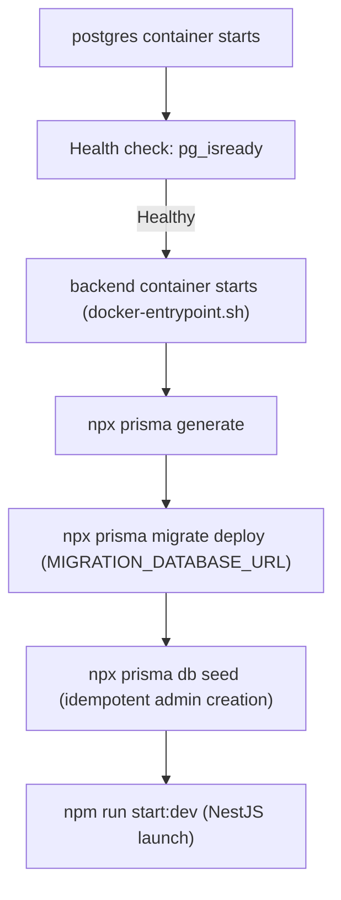

# Database Setup & Architecture Guide

## 1. Overview & Technology Stack

- **RDBMS:** PostgreSQL 16 on **Debian Bookworm** (`postgres:16-bookworm`).
- **ORM / Migrations:** Prisma 5.22.x with committed SQL migrations.
- **Backend Runtime:** Node.js 22.23.3 on **Debian Bookworm** (`node:22.23.3-bookworm-slim`).
- **Framework:** NestJS 10 with global `DatabaseModule` and injectable `PrismaService`.
- **Password Hashing:** Argon2id via `argon2` npm package.

---

## 2. Role Separation & Security Architecture

Following project security standards, database roles are strictly separated:

| Role | Environment Variable | Responsibilities | Privileges |
| :--- | :--- | :--- | :--- |
| **Database Owner** | `POSTGRES_USER` (`chess_owner`) | Running schema migrations, DDL execution, seed bootstrap | Superuser / schema owner (`CREATE TABLE`, `DROP`, `ALTER`) |
| **Application User** | `APP_DB_USER` (`chess_app`) | Handling runtime NestJS REST & WebSocket queries | Restricted CRUD (`SELECT`, `INSERT`, `UPDATE`, `DELETE`) |

### Role Initialization (`01-init-roles.sh`)
When the PostgreSQL data volume (`db_data`) is initialized for the first time:
1. Docker executes `backend/prisma/init-db/01-init-roles.sh`.
2. It creates role `APP_DB_USER` with `APP_DB_PASSWORD`.
3. Grants `CONNECT` on `POSTGRES_DB` and `USAGE` on schema `public`.
4. Configures `ALTER DEFAULT PRIVILEGES` so that all future tables and sequences created by `POSTGRES_USER` during migrations automatically grant CRUD access to `APP_DB_USER`.

---

## 3. Database Schema Contract

### User (`users`)
- **`id`**: UUID primary key (`@default(uuid())`).
- **`email`**: Unique lowercase canonical email, ASCII validation, `"C"` collation.
- **`username`**: Unique handle `^[a-z0-9_]{3,20}$`, `"C"` collation.
- **`rating`**: ELO rating, defaults to `1200`.
- **`password_hash`**: Argon2id encoded string.
- **`role`**: User authorization level: `'user'` (default) or `'admin'`.
- **`status`**: Presence indicator: `'offline'` (default), `'online'`, `'in_game'`.
- **`created_at` / `updated_at`**: Timestamps in `TIMESTAMPTZ(3)`.

### Session (`sessions`)
- **`id`**: UUID primary key.
- **`user_id`**: Foreign key to `users.id` with `ON DELETE CASCADE`.
- **`token_hash`**: SHA-256 hex digest of the bearer token, `"C"` collation, check `^[0-9a-f]{64}$`.
- **`created_at` / `expires_at`**: `TIMESTAMPTZ(3)`, enforced check `expires_at > created_at`.

### Game (`games`)
- **`id`**: UUID primary key.
- **`white_id` / `black_id`**: Foreign keys to `users.id` with `ON DELETE SET NULL` (preserves historical match logs).
- **`result`**: `'WHITE_WON'`, `'BLACK_WON'`, `'DRAW'`, `'IN_PROGRESS'`, `'ABORTED'`.
- **`end_reason`**: Match conclusion reason (`'CHECKMATE'`, `'RESIGNATION'`, `'TIMEOUT'`, etc.).
- **`time_control`**: Match timing format (e.g. `'rapid_10_0'`, `'blitz_5_3'`).
- **`white_rating` / `black_rating`**: Initial ELO ratings.
- **`white_rating_change` / `black_rating_change`**: Rating deltas applied after completion.
- **`pgn`**: Full game PGN notation string.
- **`game_start` / `game_end`**: Timestamps with check `game_end IS NULL OR game_end >= game_start`.

### Game Moves (`game_moves`)
- **`id`**: UUID primary key.
- **`game_id`**: Foreign key to `games.id` with `ON DELETE CASCADE`.
- **`ply`**: Sequential half-move counter (1 = White move 1, 2 = Black move 1, 3 = White move 2, etc.; check `ply >= 1`).
- **`move_number`**: Full move number (1, 1, 2, 2, 3, 3...; check `move_number >= 1`).
- **`color`**: `'WHITE'` or `'BLACK'`.
- **`played_by_id`**: Foreign key to `users.id` with `ON DELETE SET NULL` (nullable for AI moves).
- **`san`**: Standard Algebraic Notation (e.g. `'e4'`, `'Nf3'`, `'O-O'`, `'e8=Q#'`), `"C"` collation.
- **`uci`**: Universal Chess Interface notation (e.g. `'e2e4'`), `"C"` collation.
- **`fen_after`**: FEN board state representation after this move.
- **`time_spent_ms` / `time_remaining_ms`**: Clock timing tracking.
- **Unique Constraint**: `(game_id, ply)` guarantees strict move sequencing per match.

---

## 4. Container Startup & Migration Lifecycle

When running `docker compose up --build` or `make up`:



1. **`postgres`** starts and checks readiness via `pg_isready`.
2. **`backend`** waits until `postgres` reports healthy.
3. **`docker-entrypoint.sh`**:
   - Generates Prisma client bindings (`npx prisma generate`).
   - Applies any unapplied migrations via `MIGRATION_DATABASE_URL` (`npx prisma migrate deploy`).
   - Runs idempotent seeding via `npx prisma db seed`.
   - Starts the NestJS development server.

---

## 5. Admin Bootstrap Seeding

Initial admin credentials can be set in `.env`:
```dotenv
ADMIN_EMAIL=admin@transcendence.local
ADMIN_USERNAME=admin
ADMIN_PASSWORD=replace-with-secure-admin-password
```

On startup, `backend/prisma/seed.ts`:
- Checks if a user with `ADMIN_EMAIL` or `ADMIN_USERNAME` already exists.
- If missing, securely hashes `ADMIN_PASSWORD` using Argon2id and creates the user with `role: 'admin'`.
- If an admin exists, it safely skips insertion without error.

---

## 6. Volume Management & Persistence

- **Data Persistence:** Database files are stored in the Docker named volume `db_data`. They persist across `docker compose down` and system reboots.
- **Resetting Database (Destructive):**
  To perform a complete clean reset (erasing all accounts, matches, and tables):
  ```bash
  make clean
  # or: docker compose down -v
  ```
  On the subsequent `make up`, PostgreSQL will re-run the role initialization script and the backend entrypoint will recreate tables and the admin account from scratch.
